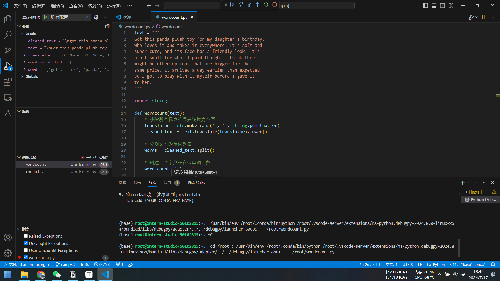
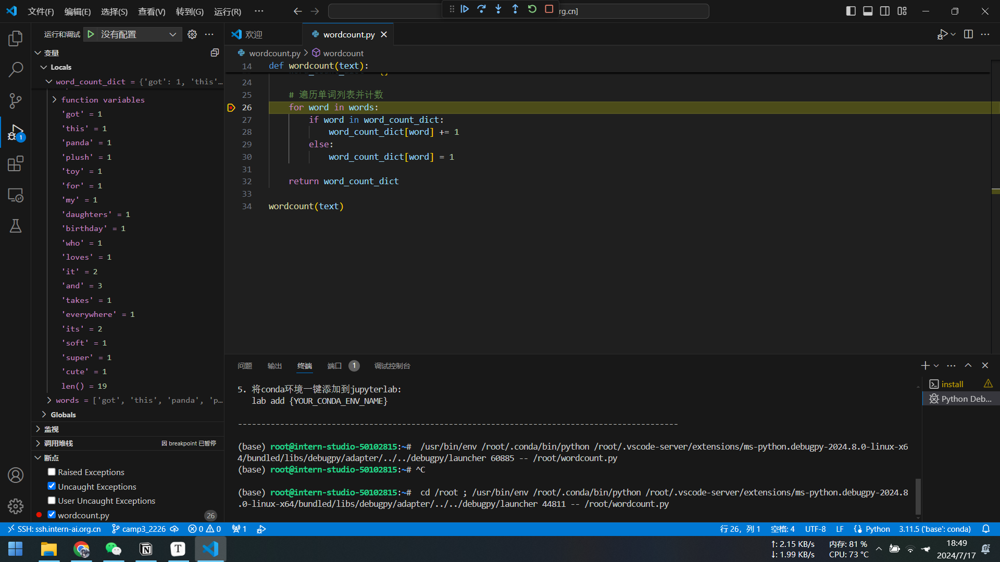
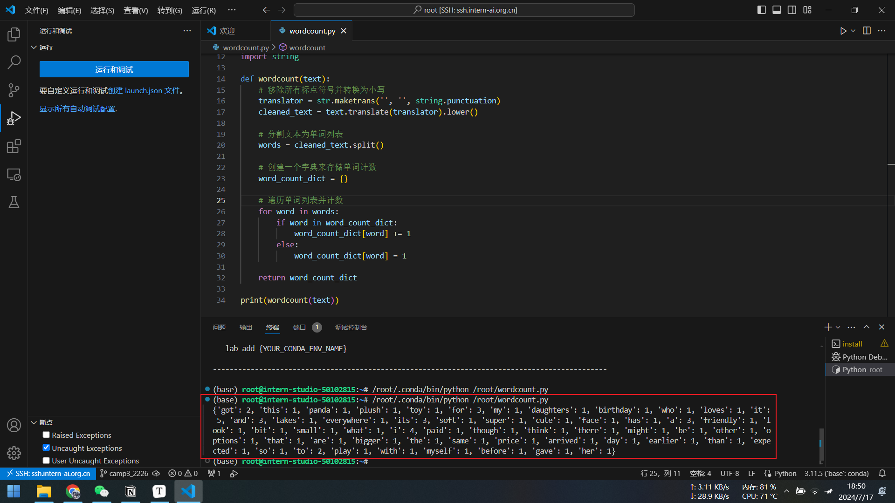

# 代码实现

```python
text = """
Got this panda plush toy for my daughter's birthday,
who loves it and takes it everywhere. It's soft and
super cute, and its face has a friendly look. It's
a bit small for what I paid though. I think there
might be other options that are bigger for the
same price. It arrived a day earlier than expected,
so I got to play with it myself before I gave it
to her.
"""

import string

def wordcount(text):
    # 移除所有标点符号并转换为小写
    translator = str.maketrans('', '', string.punctuation)
    cleaned_text = text.translate(translator).lower()
    
    # 分割文本为单词列表
    words = cleaned_text.split()
    
    # 创建一个字典来存储单词计数
    word_count_dict = {}
    
    # 遍历单词列表并计数
    for word in words:
        if word in word_count_dict:
            word_count_dict[word] += 1
        else:
            word_count_dict[word] = 1
    
    return word_count_dict

print(wordcount(text))
```


# Debug

已经连接远程开发机，开始debug



运行几次循环后查看字典内变量



程序运行无误，去掉断点运行程序得到结果

